# Deploy and Configure Nginx Web Server using Ansible

## Objectives 

* Understand how Ansible simplifies the deployment and configuration of applications. 
* Set up an Ansible environment for managing Linux servers.
* Create and execute an Ansible playbook to install Nginx
* Configure a basic Nginx website using Ansible 
* Verify the Nginx deployment.

## Task Outline 
1. Install and configure Ansible on the control machine
2. Set up an inventory file for the target Linux server
3. Create an Ansible playbook to install Nginx
4. Configure a custom Nginx website using Ansible.
5. Verify the Nginx deployment and access the website


## Solution
 
__Install Ansible on the control node.__

Log into the VM using the command 

`vagrant controller ssh`

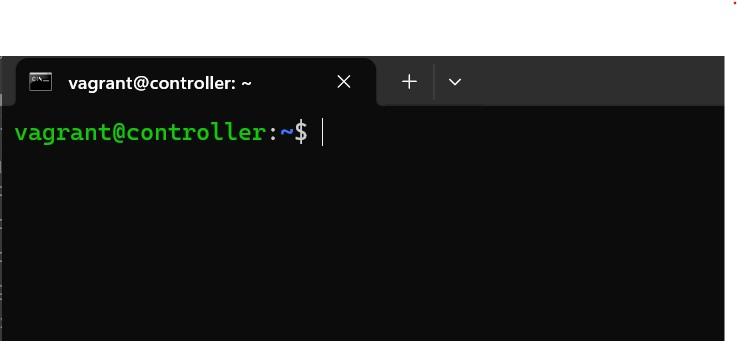

To use Ansible, you need to have Python installed. 

verify Python installation 

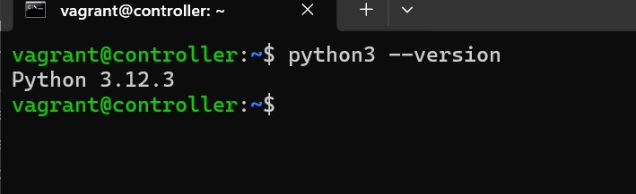

If python is not installed, you can use your Linux distro package manager to install it. 

Depending on your Linux distribution, use the documentation on the [Ansible website](https://docs.ansible.com/projects/ansible/5/installation_guide/intro_installation.html#installing-ansible-on-specific-operating-systems) to install Ansible 

Since I am using a debian based system, I used the commands: 

```bash
$ sudo apt update
$ sudo apt install software-properties-common
$ sudo add-apt-repository --yes --update ppa:ansible/ansible
$ sudo apt install ansible
```

verify Ansible is successfully installed:

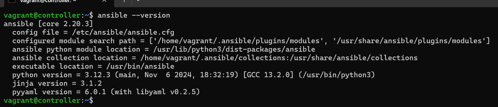

>NOTE:
You do not need to install Ansible on the managed node, but **ONLY on the control node.** This is the *Agentless* feature of Ansible that differenciates it from other configuration management tools.
>

__Configure SSH key-based authentication__

Generate an SSH key-pair on the control node. This key would be used by Ansible for managing the remote machine. 

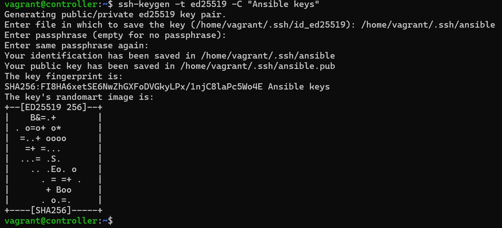

Configure SSH access into the remote machine, so that we can copy the newly created key without using a password. 

>>NOTE: This is possible because of the Vagrant configuration of these VMs.
>

Next, copy the public key to the target machine

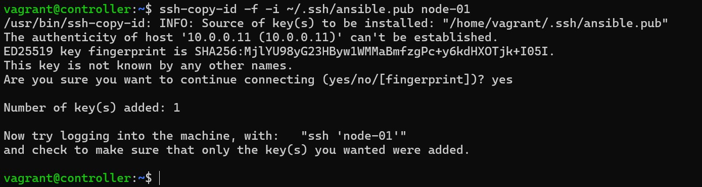

Test ssh access with new key 

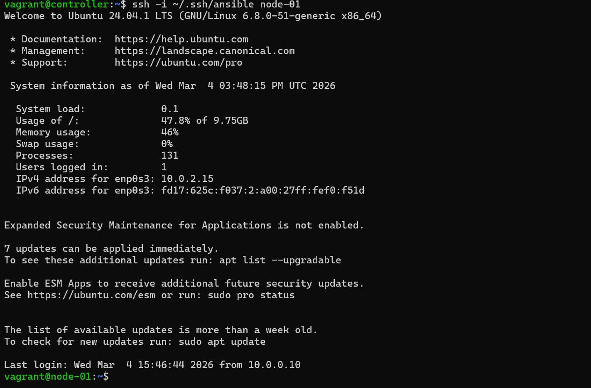

__create an inventory file for target machines__

Ansible automates tasks on managed nodes or “hosts” in your infrastructure by using a list or group of lists known as inventory.

create a directory for ansible configuration 

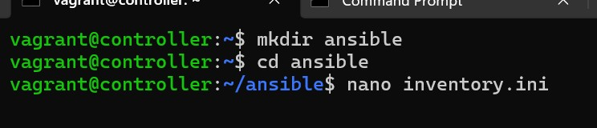

configure the inventory with the below configurations

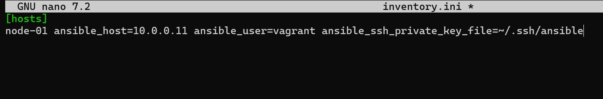


__Create an Ansible playbook to install Nginx__

Use the command:  `nano install_nginx.yaml` to create the playbook.  


Add the below content to the playbook:

[install_nginx.yaml](install_nginx.yaml)
```yaml
# PLAY TO INSTALL NGINX ON THE SERVER
- name: Install Nginx on the server
  hosts: hosts
  become: yes
  tasks:
    - name: Install Nginx
      apt:
        name: nginx
        state: present
        update_cache: yes

    - name: Ensure Nginx is running
      service:
        name: nginx
        state: started
        enabled: yes
```
Then save the file. 

You can use the command. 

`ansible-playbook --syntax-check install_nginx.yaml` to ensure there are no YAML syntax errors.

__Configure a custom Nginx website using Ansible__

Create a playbook for the Nginx website configuration

[configure_nginx.yaml](configure_nginx.yaml)
```bash
nano configure_nginx.yaml
```

Add the below playbook content

```yaml
#PLAY TO CONFIGURE ANSIBLE
- name: Configure Nginx website
  hosts: hosts
  become: yes
  tasks:
    - name: Create website root directory
      file:
        path: /var/www/mywebsite
        state: directory
        mode: '0755'

    - name: Deploy HTML content
      copy:
        content: |
          <html>
          <head><title>Welcome to My Website</title></head>
          <body>
          <h1>This is node-01 server<h1/>
          </body>
          </html>
        dest: /var/www/mywebsite/index.html

    - name: Configure Nginx server block
      copy:
        content: |
          server {   
          listen 8080 default_server;                                  
          root /var/www/mywebsite;                 
          index index.html;

            location / 
              {                     
                try_files $uri $uri/ =404;         
              }
          }
        dest: /etc/nginx/sites-available/mywebsite

    - name: Enable the Nginx Site
      file:
        src: /etc/nginx/sites-available/mywebsite
        dest: /etc/nginx/sites-enabled/mywebsite
        state: link

    #- name: Remove default Nginx Site
    #  file:
    #    path: /etc/nginx/sites-enabled/default
    #    state: absent

    - name: Reload Nginx
      service:
        name: nginx
        state: reloaded
```

__Verify the Nginx deployment and access the website__

Run the playbooks to install and configure nginx

```bash
ansible-playbook -i inventory.ini install_nginx.yaml
ansible-playbook -i inventory.ini configure_nginx.yaml
```

Output of Nginx install playbook

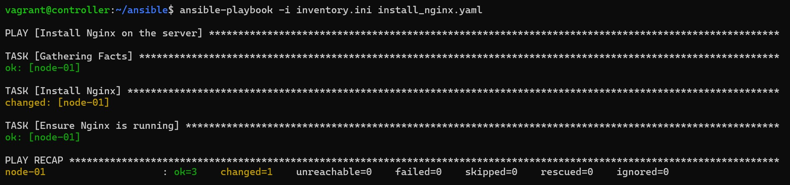

Output of Nginx configuration playbook

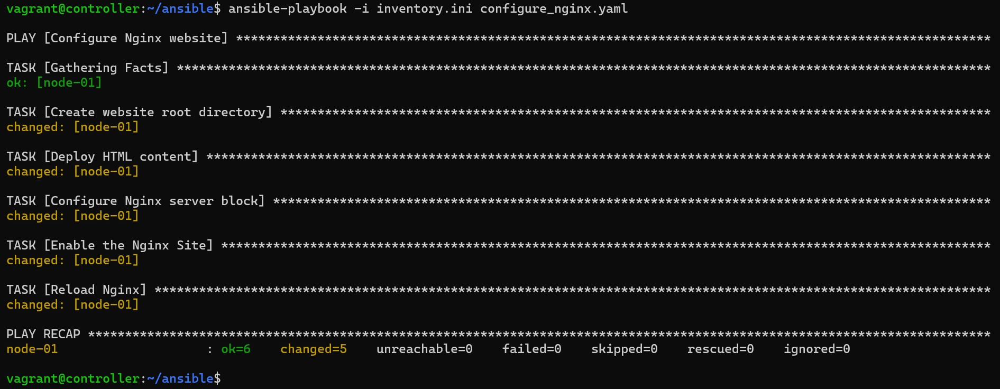

__Verify Nginx is running on the target server__

Use the curl command to view the HTTP status when we access the website.

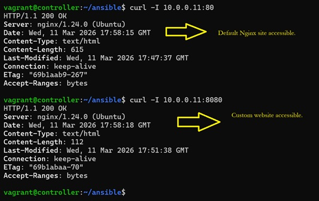

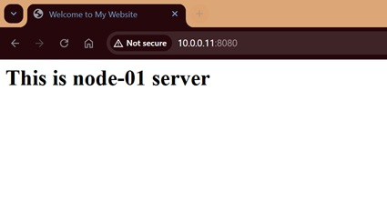

