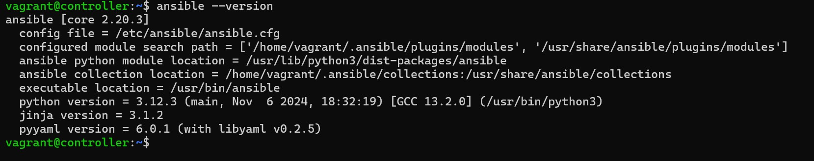
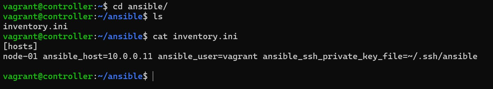
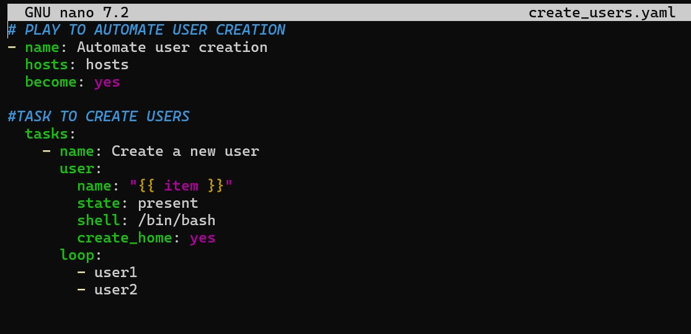
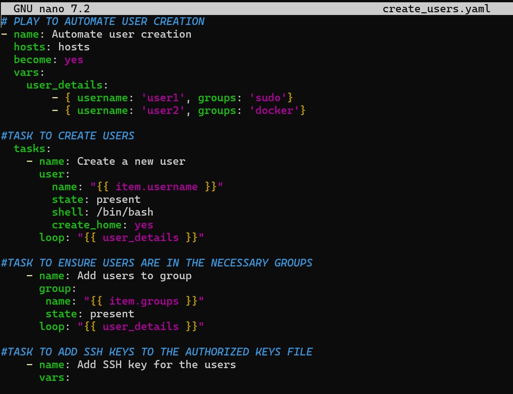
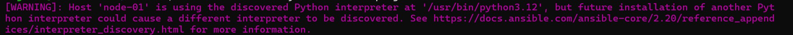
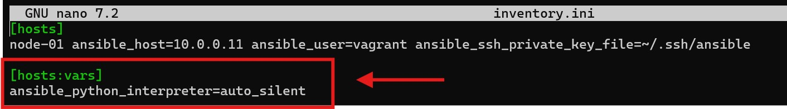
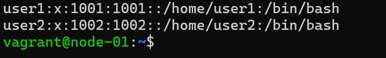
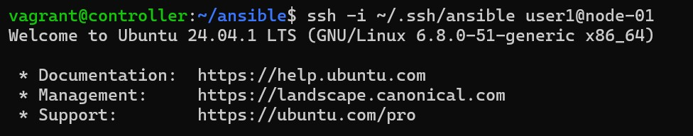
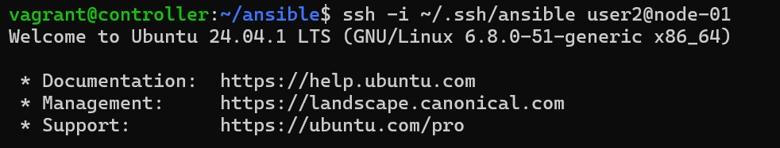

# Automate User creation using Ansible

## Objectives 

* Understand the basics of Ansible and its automation   capabilities
* Set up an Ansible environment to manage Linux servers.
* Create an Ansible playbook to automate user creation.
* Configure additional settings like home directory, groups, and SSH access.
* Verify the user creation process and test access. 

## Task Outline

* Install and configure Ansible on the control machine
* Set up an inventory file for the target Linux server
* Create an Ansible playbook to automate user creation
* Verify user creation and test login 

## Solution

__Install and configure Ansible on controll machine__

If Ansible is not already installed on your controll node, you can use 
To install Ansible, you can use the commands:

```bash
#update package list in repository
sudo apt update 

#Install latest stable version of 
sudo apt install ansible Ansible
```
Verify Ansible is installed.



For a detailed instruction of Ansible setup, including configuring SSH access for the control node, check out this guide: [ansible setup](setting%20up%20ansible.md)

[Ansible Setup](setting%20up%20ansible.md)

__Set up an inventory file for the target Linux server__

Use the command `touch inventory.ini` to create an Inventory file. 

I already have a created an inventory file in the ansible directory




__Create an Ansible playbook to automate user creation__

In the ansible directory, create a YAML file named create_users.yaml 


Then, add the below contents



We can also configure additional settings for our users



Before running the playbook, you can use these commands to verify our playbook is set to run: 

The full palybook file: [create_users.yaml](create_users.yaml)

```bash
#verify if the playbook YAML syntax is valid
ansible-playbook -i inventory.ini --syntax-check create_users.yaml  

#Do a dry-run of the command and see what happens when you run the playbook
ansible-playbook -i inventory.ini -C create_users.yaml 
```


__Verify user creation and test login__

Before running the playbook, add the following configuration to the inventory file to avoid some informational message from displaying. 

Informational message:



Add to inventory file




To learn more about why you might see this message, review this documentation: [interpreter discovery](https://docs.ansible.com/projects/ansible-core/2.20/reference_appendices/interpreter_discovery.html)


To run the playbook, use the below command:

```bash
ansible-playbook -i inventory.ini create_users.yaml
```

To verify that the command ran successfully check the target server to see if the users were created.



Test SSH access for newly created users





__project complete !__