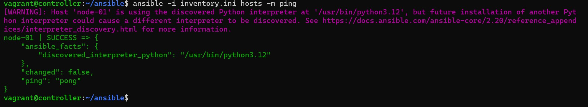
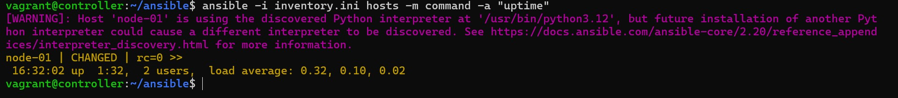
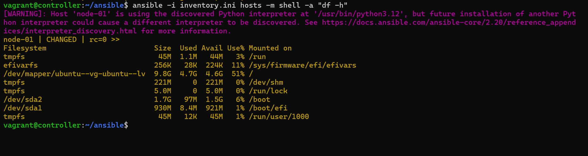

# Setting up Ansible on a Linux Server

Ansible is a powerful automation tool that simplifies the management of IT infrastructure. 
Setting up Ansible on a Linux server is the first step towards leveraging its capabilities. 
This project walks through installing and configuring Ansible on a Linux server 
allowing task automation and effective server management 

## Objectives 
* Understand what Ansible is and how it works
* Install and configure Ansible on a Linux control node. 
* Set up SSH key-based authentication for target nodes. 
* Create an Ansible inventory file. 
* Verify Ansible setup by running basic commands. 

## Pre requisites
* Linux Machine: A Linux server or VM to act as the control node
* Target Machine(s): At least one additional Linux server or VM machine for Ansible to manage
* SSH Access: Access to target nodes with SSH
* Tools: Basic Knowledge of the Linux CLI and text editor. 

## Task Outline
1. Install Ansible on the control node. 
2. Configure SSH key-based authentication
3. Create an inventory file for target machine(s)
4. Test Ansible connectivity to target machine(s)
5. Run a simple Ansible ad-hoc command. 


## Setting up the lab environment 

We would use vagrant to provision the Linux Virtual Machines required for these labs. 

Review this documentation for the environment setup: [vagrant-setup](vagrant-setup.md)

Our environment consist of a two Linux virtual machines. 

One of the machine is going to be the 
controller (where we would run ansible commands) and the second would be the node VM. 

## Solution
 
__Install Ansible on the control node.__

Log into the VM using the command 

`vagrant controller ssh`


To use Ansible, you need to have Python installed. 

verify Python installation 


If python is not installed, you can use your Linux distro package manager to install it. 

Depending on your Linux distribution, use the documentation on the [Ansible website](https://docs.ansible.com/projects/ansible/5/installation_guide/intro_installation.html#installing-ansible-on-specific-operating-systems) to install Ansible 

Since I am using a debian based system, I used the commands: 

```bash
$ sudo apt update
$ sudo apt install software-properties-common
$ sudo add-apt-repository --yes --update ppa:ansible/ansible
$ sudo apt install ansible
```

verify Ansible is successfully installed:


>>NOTE:
You do not need to install Ansible on the managed node, but **ONLY on the control node.** This is the *Agentless* feature of Ansible that differenciates it from other configuration management tools.
>

__Configure SSH key-based authentication__

Generate an SSH key-pair on the control node. This key would be used by Ansible for managing the remote machine. 


Configure SSH access into the remote machine, so that we can copy the newly created key without using a password. 

>>NOTE: This is possible because of the Vagrant configuration of these VMs.
>

Next, copy the public key to the target machine


Test ssh access with new key 


__create an inventory file for target machines__

Ansible automates tasks on managed nodes or “hosts” in your infrastructure by using a list or group of lists known as inventory.

create a directory for ansible configuration 


configure the inventory with the below configurations


__Test connectivity__



Ansible successfully connected to the remote machine. 

__Run a simple Ansible ad-hoc command__

Using Ansible to check uptime of target machine



Using Ansible to check disk usage of target machine




