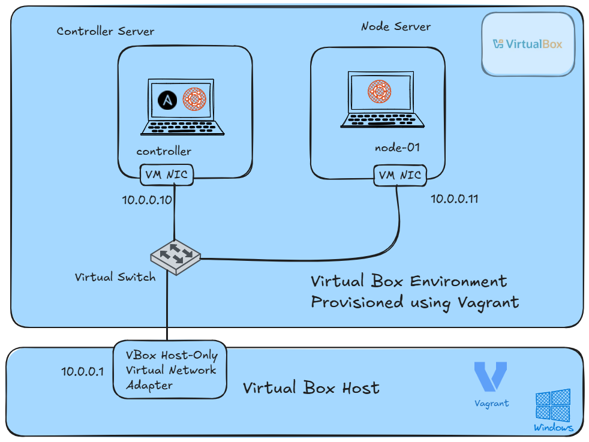

# Vagrant Setup 

This document provides a simple vagrant environment you can run on your local machine for Ansible lab testing. 

It can be used with the accompanying Ansible labs in this repository, or for any lab practice of your choice. 

# Lab Diagram Overview



# Pre-requisites 

To use this lab, you need to have the following programs installed on your machine. 

* [Vagrant CLI](https://developer.hashicorp.com/vagrant/install) installed locally on your machine

* [VirtualBox 7.1.4 or higher](https://www.virtualbox.org/wiki/Downloads) installed as your virtualization provider

# Lab Setup 

```bash
# Clone the repository 
git clone https://github.com/onakorame-dimon/ansible-labs.git

#Ensure you are in the repository directory
cd ansible-labs

# In the repository directory, there is a Vagrant file. Use the below command to provision the lab environment

vagrant up 

# You should see the below output

Bringing machine 'node-01' up with 'virtualbox' provider...
Bringing machine 'controller' up with 'virtualbox' provider...

==> node-01: Cloning VM...
==> node-01: Matching MAC address for NAT networking...

--SNIP--

==> controller: Cloning VM...
==> controller: Matching MAC address for NAT networking...

--SNIP--

#Verify if the machines are running
vagrant status 

#To Access machines 

#Login to the controller machine
vagrant ssh controller

#Login to the managed node machine
vagrant ssh node-01

#When you finish with the labs, you can clean the resources by using the below command

vagrant destroy
```

# Happy Labbing
we have succesfully set up a simple vagrant environment that can be used for Ansible testing. 

Enjooyyyyy !!!